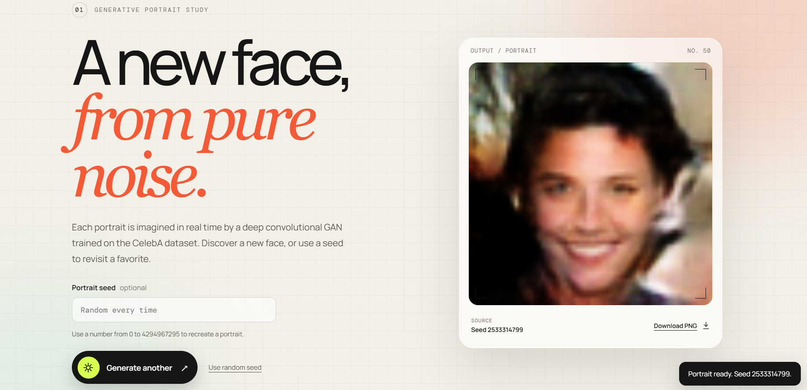

# 🎭 Latent Faces — DCGAN Face Generator

A Generative AI web application that generates synthetic
64×64 human faces using a Deep Convolutional Generative
Adversarial Network (DCGAN).

The trained PyTorch generator is served through a Flask
application and generates a new synthetic portrait from a
random latent vector on demand.

## 🖼️ Demo



## ✨ Features

- DCGAN-based synthetic face generation
- Random latent vector sampling
- Reproducible seed-based generation
- Flask web interface
- CUDA acceleration with CPU fallback
- Portrait history
- PNG downloads
- Automated inference tests
- CelebA fine-tuning workflow
- Training checkpoint and resume support

## 🛠️ Tech Stack

- Python
- PyTorch
- DCGAN
- Flask
- NumPy
- Pillow
- HTML
- CSS
- JavaScript


# Latent Faces — Flask DCGAN Demo

A small Flask application that loads `generator.pth` once at startup and creates a new 64×64 synthetic face from a fresh random latent vector whenever the user clicks **Generate a face**.

## Run locally

Python 3.10 or newer is recommended.

```powershell
python -m venv .venv
.\.venv\Scripts\Activate.ps1
python -m pip install -r requirements.txt
python app.py
```

Open [http://127.0.0.1:5000](http://127.0.0.1:5000) in a browser.

## Project structure

```text
Face_Generation/
├── app.py                 # Flask app, DCGAN architecture, and inference
├── generator.pth          # Trained generator checkpoint
├── requirements.txt
├── static/
│   ├── app.js             # Generate/regenerate interaction
│   └── style.css          # Responsive interface
└── templates/
    └── index.html
```

The app automatically uses CUDA when available and falls back to CPU. The checkpoint remains server-side and is never sent to the browser.

## Portrait seeds and history

Leave the seed blank for a random portrait, or enter a whole number from 0 to
4294967295 to reproduce a result. Reproduction assumes the same checkpoint,
PyTorch environment, and device; results may differ across hardware or versions.
The last eight portraits remain available for the current page visit. Select a
thumbnail to restore its preview, download, and seed. Downloaded PNG filenames
include the seed. Refreshing the page clears the gallery.

`POST /generate` returns a PNG and its seed in the `X-Generation-Seed` header.
`POST /generate?seed=42` generates a specific seed. Invalid seeds return HTTP 400
with a JSON error; generation failures return HTTP 500 with a safe error message.
The browser stops waiting after 60 seconds; server inference may still finish.

## Tests

With the environment activated, run:

```powershell
python -m unittest discover -s tests -v
```

These tests use the supplied checkpoint to check PNG output, seed reproduction,
input validation, page assets, and recovery after an inference failure.

## Fine-tune this generator on CelebA

Open `Fine_tune_CelebA.ipynb` in Google Colab using **File > Upload notebook**.
The notebook contains the model and training source, so you only upload the notebook,
your original `generator.pth`, and your Kaggle credentials when prompted in Colab.
Select a GPU runtime, run the cells in order, and use the supplied
`jessicali9530/celeba-dataset` download. Check the image crop preview before training.
The original training transforms were not provided; the default is resize-shortest-edge
then center crop, as in the PyTorch DCGAN tutorial. A 108-pixel original-image crop is optional.

This workflow fine-tunes the existing generator without changing its architecture.
It initializes a new spectral-normalized discriminator, warms it up for 200 steps,
then trains both networks using logistic loss, R1 regularization, a lower generator
learning rate, and EMA generator exports. Settings are experimental starting points,
not a guarantee of improved quality. Output remains 64x64.

Start with five epochs. Compare `before.png` with epoch grids and the fresh-seed
comparisons in the notebook. Losses are diagnostics, not quality scores. No automatic
best-model selection or FID/KID claim is made. The data download code alone does not
supply the original training history or discriminator state.

Google Drive stores the original, per-epoch candidate generators, comparison grids,
and `latest.pt` containing both networks, optimizers, and random states. Resume from
this checkpoint after a disconnect; an incomplete epoch is repeated. Resume is not
promised to be bit-exact across devices or data-loader worker configurations. Increase
the total epoch target to train longer. Other saved training settings must match.
Use a fresh output directory for a new experiment. A 200-step warm-up must complete
before generator updates begin; extremely small datasets may need more epochs.

To try a downloaded candidate without overwriting the original:

```powershell
$env:FACE_MODEL_PATH = "generator-epoch-005.pth"
.\venv\Scripts\python.exe app.py
```

To return to the original, remove `FACE_MODEL_PATH` and restart the app.
The default remains `generator.pth`.

For training with an already extracted local dataset and a CUDA-enabled PyTorch installation:

```powershell
python train.py --data "C:\datasets\celeba" --checkpoint generator.pth --output training_output --epochs 5
```

The training code needs PyTorch and Pillow, already listed in `requirements.txt`;
Kaggle is only needed for the notebook's dataset download. `models.py` is shared by
training and the app. `train.py --help` lists training options. `--max-batches` is only
for plumbing smoke tests, not quality evaluation. Tests use synthetic images to verify
training mechanics and the supplied checkpoint to verify inference; they do not prove
an improvement in realism. Actual CelebA fine-tuning must still run in Colab.

### Train without mounting Google Drive

Use `Fine_tune_CelebA_No_Drive.ipynb` for temporary Colab storage. It requires no Drive
mount or authorization. Start with one epoch, run the backup-download cell, and wait
for the download to finish. Increase the total epoch target to continue training.
Colab's temporary files disappear when the runtime is deleted or expires. The notebook
includes an optional restore cell for your downloaded backup in a new runtime; rerun
the dataset and source-code setup afterward. Backups contain training state and images,
not the dataset or Kaggle credentials. The original Drive-based notebook is also available.
